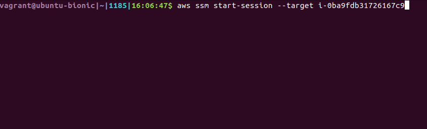
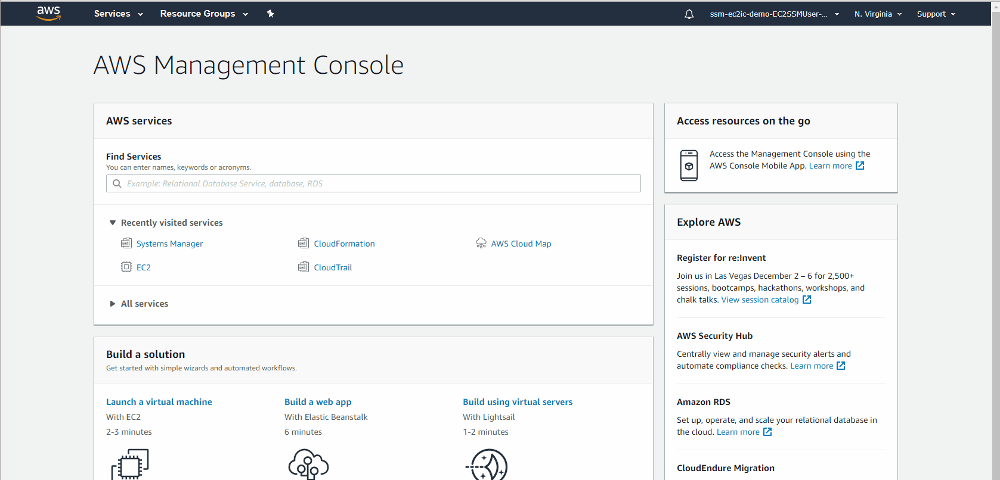
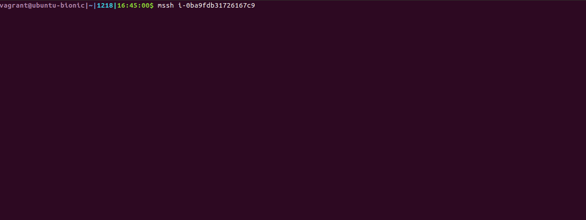

# **Secure Remote Access to AWS EC2 Instances**

This demonstration will show two examples of how to configure your AWS resources to allow secure access to your EC2 instances.

---
## **End-State Preview**
### **Systems Manager Session Manager Shell Access**

The first example uses Systems Manager Session Manager to drop the user directly into a command shell on the instance.

This can be done either from the AWS CLI:




Or the AWS Console:



This connectivity is purely through the SSM service. Access is controlled via IAM and there are no Security Group rules or SSH keys involved.  One notable downside to usability with this option is files can't be transferred to/from the server over this connection, which many users are used to doing with ssh/scp.

### **Systems Manager Session Manager SSH Tunneling with EC2 Instance Connect**

The second example uses Systems Manager Session Manager to establish an SSH Tunnel to the instance combined with EC2 Instance Connect to publish temporary (60 seconds) SSH keys to the instance. This can be done using the `mssh` and `msftp` commands that will be installed as part of the EC2 Instance Connect CLI:



This connectivity is still primarily through the SSM service, which establishes the SSH Tunnel.  The `mssh` or `msftp` command will generate a temporary private/public SSH key pair and make a CLI call to publish the public key to the EC2 instance. Again, access is controlled via IAM, there are still no Security Group rules, and although SSH keys are involved, they are temporary, so don't need to be maintained, distributed, or rotated.  Users will have an experience very close to what they're used to with ssh/scp.

---
## **CLI Setup**

### Install Components
If you would like to try it, you could try using [my AWS IDE](https://github.com/mjuettner/aws-ide) as your CLI environment for this demo, it is exactly what I used to create this.  It's a little heavy though and has taken about 20-30 minutes to build when I've tested it.

Otherwise, install the following components in your client environment:
- [AWS CLI](https://docs.aws.amazon.com/cli/latest/userguide/cli-chap-install.html)
- [Session Manager Plugin for the AWS CLI](https://docs.aws.amazon.com/systems-manager/latest/userguide/session-manager-working-with-install-plugin.html)
- [EC2 Instance Connect CLI](https://docs.aws.amazon.com/AWSEC2/latest/UserGuide/ec2-instance-connect-set-up.html#ec2-instance-connect-install-eic-CLI)

### Configure Components

- [Enable SSH Connections Through Session Manager](https://docs.aws.amazon.com/systems-manager/latest/userguide/session-manager-getting-started-enable-ssh-connections.html)
- A small modification is required to the EC2 Instance Connect CLI
  - You can read [my Github issue](https://github.com/aws/aws-ec2-instance-connect-cli/issues/5) concerning this
  - In summary, locate where the EC2 Instance Connect CLI is installed in your environment, modify EC2InstanceConnectCommand.py, and near the end of the file, change this:
  ```
    if instance_bundle.get('host_info', None):
      target = "{0}@{1}".format(instance_bundle['username'], instance_bundle['host_info'])
  ```
  To this:
  ```
    if instance_bundle.get('host_info', None):
      target = "{0}@{1}".format(instance_bundle['username'], instance_bundle['instance_id'])
  ```
  - This will modify the `mssh` (and `msftp`) command to ultimately execute `ssh <instance-id>` instead of `ssh <instance-ip-address>`

---
## **Configure Resources**

### CloudFormation Walkthrough

Deploy the `ssm-ec2ic-demo.yaml` CloudFormation template to your environment, it will create the following basic infrastructure:
- A VPC, public subnet, and private subnet
- An Internet Gateway and a NAT Gateway
- A Security Group with no Ingress rules

Then it will create the following resources that have some configurations specific to this demonstration:

InstanceRole: The role for the EC2 instance.  The permissions granted by the AmazonSSMManagedInstanceCore policy attached to it are required for both connectivity options to work.

```
  InstanceRole:
    Type: 'AWS::IAM::Role'
    Properties:
      AssumeRolePolicyDocument:
        ...
      ManagedPolicyArns:
        - arn:aws:iam::aws:policy/AmazonSSMManagedInstanceCore
```
<br>
EC2: It is very important the EC2 instance has the most recent version of the SSM Agent installed. This UserData input will satisfy that. Note that the instance is completely isolated. There are no ingress security group rules, there is no access key attached, and it's residing on a private subnet. It is leveraging the NAT Gateway (and Internet Gateway) to communicate with and register with the public AWS Systems Manager endpoint.

```
  EC2:
    Type: 'AWS::EC2::Instance'
    Properties:
      ...
      UserData:
        Fn::Base64: !Sub |
          #!/bin/bash -xe
          # From: https://docs.aws.amazon.com/systems-manager/latest/userguide/sysman-manual-agent-install.html
          yum install -y https://s3.amazonaws.com/ec2-downloads-windows/SSMAgent/latest/linux_amd64/amazon-ssm-agent.rpm
```
<br>
SSMAccessOnly: This is a basic permission set for SSM access to work. This example restricts the permissions to just the EC2 instance created as part of this CloudFormation template, you can always expand that however you want, let it apply to all EC2 instances in your account, restrict what it applies to with Conditions, etc.

```
  SsmAccessOnly:
    Type: 'AWS::IAM::ManagedPolicy'
    Properties:
      Description: Provides user permissions needed to access EC2 instances via Systems Manager Session Manager
      PolicyDocument:
        Version: 2012-10-17
        Statement:
          - Sid: ReadOnly
            Effect: Allow
            Action:
              - 'ssm:DescribeSessions'
              - 'ssm:GetConnectionStatus'
              - 'ssm:DescribeInstanceProperties'
              - 'ec2:DescribeInstances'
            Resource:
              - '*'
          - Sid: StartSession
            Effect: Allow
            Action:
              - 'ssm:StartSession'
            Resource:
              - !Sub 'arn:aws:ec2:${AWS::Region}:${AWS::AccountId}:instance/${EC2}'
          - Sid: TerminateSession
            Effect: Allow
            Action:
              - 'ssm:TerminateSession'
            Resource:
              - 'arn:aws:ssm:*:*:session/${aws:username}-*'
```
<br>
SsmAndSshAccess: This expands the basic SSM access to allow the user to use SSM to establish the SSH tunnel (by referencing the AWS-StartSSHSession document) and to allow the user to publish the temporary public SSH key to the EC2 instances metadata (using SendSSHPublicKey). Again, this example restricts permissions to just the demo EC2 instance, but you can have it apply to the EC2 resources in your environment however you want.  

Since this SSH Tunnel connectivity option is built upon the SSM shell connectivity option, you can actually use either method to connect to your EC2 instance using this policy. If you would rather force the user to only use the SSH Tunnel method, you can uncomment the section noted in the template.

```
  SsmAndSshAccess:
    Type: 'AWS::IAM::ManagedPolicy'
    Properties:
      Description: Provides user permissions needed to access EC2 instances via Systems Manager Session Manager SSH Tunneling and EC2 Instance Connect
      PolicyDocument:
        Version: 2012-10-17
        Statement:
          - Sid: ReadOnly
            Effect: Allow
            Action:
              - 'ssm:DescribeSessions'
              - 'ssm:GetConnectionStatus'
              - 'ssm:DescribeInstanceProperties'
              - 'ec2:DescribeInstances'
            Resource:
              - '*'
          - Sid: StartSession
            Effect: Allow
            Action:
              - 'ssm:StartSession'
            Resource:
              - !Sub 'arn:aws:ec2:${AWS::Region}:${AWS::AccountId}:instance/${EC2}'
              - !Sub 'arn:aws:ssm:${AWS::Region}::document/AWS-StartSSHSession'
            #Uncomment to disallow SSM and force user to use SSH
            #Condition:
            #  BoolIfExists:
            #    ssm:SessionDocumentAccessCheck: true
          - Sid: TerminateSession
            Effect: Allow
            Action:
              - 'ssm:TerminateSession'
            Resource:
              - 'arn:aws:ssm:*:*:session/${aws:username}-*'
          - Sid: PublishKey
            Effect: Allow
            Action:
              - 'ec2-instance-connect:SendSSHPublicKey'
            Resource:
              - !Sub 'arn:aws:ec2:${AWS::Region}:${AWS::AccountId}:instance/${EC2}'
            Condition:
              StringEquals:
                ec2:osuser: ec2-user
```
<br>
EC2SsmUser/EC2SshUserFinally, we just create two users and apply one policy to each of them.

You should generate a Password and Access Key pair for each of them to use in testing.

```
  EC2SsmUser:
    Type: 'AWS::IAM::User'
    Properties:
      ManagedPolicyArns:
        - !Ref SsmAccessOnly
  EC2SshUser:
    Type: 'AWS::IAM::User'
    Properties:
      ManagedPolicyArns:
        - !Ref SsmAndSshAccess
```

---
## **Testing**

For simplicity sake, you should just set up your `credentials` file with a `[default]` profile containing your Access Key. Just keep one `credentials` file for each user and swap them around as you test.

- Log in to the AWS Console as either user and navigate to Systems Manager Session Manager and initiate a shell session in your browser as shown in the animated gif above.
- From your AWS CLI, with either users keys in the `credentials` file, initiate a shell session.
  - `aws ssm start-session --target <instance-id>`
- From your AWS CLI, with either users keys in the `credentials` file, initiate an `mssh` or `msftp` session.
  - `mssh <instance-id>`
  - `msftp <instance-id>`
  - These should both fail when using the EC2SsmUser user, as that users policy doesn't have access to perform these actions.
- In the SsmAndSshAccess policy, uncomment the section to force the user to use ssh.
  - Test `aws ssm start-session`, `mssh`, and `msftp` again. The `aws ssm start-session` command should fail now.

---
## **Explanation**

Without diving into all the under-the-covers complexity, the SSM shell access method is pretty straightforward. The user contacts the SSM service and requests a shell session on the EC2 instance, IAM permissions and such are checked, and SSM connects the user with a shell.

The SSH through an SSM Tunnel using temporary SSH keys is a little more involved, so here's what's going on there:
- The user executes `mssh <instance-id>` (or `msftp <instance-id>`)
- `mssh` creates a temporary SSH key pair
- `mssh` publishes the temporary public SSH key to the EC2 instances metadata
  - This permission is primarily granted by the 'ec2-instance-connect:SendSSHPublicKey' action
  - Amazon Linux 2 with the latest SSM Agent installed is configured by default to look in the instance metadata for authorized_keys
  - This public key expires from the EC2 instances metadata after 60 seconds
- `mssh` then executes `ssh <instance id>`
  - This happens because of the modification we made to EC2InstanceConnectCommand.py
- `ssh <instance id>` triggers an AWS CLI command to be run
  - This happens because of the modification we made to ~/.ssh/config
- The SSH ProxyCommand configuraton uses the AWS CLI with SSM Plugin to establish an SSH tunnel to the EC2 instance
- The SSH connection completes over the SSH tunnel
- After you exit the `mssh` session, the temporary SSH key pair is deleted from your client